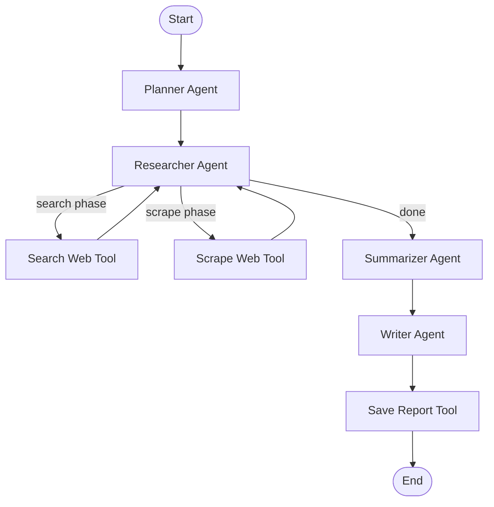

# 🤖 Autonomous Research Agent with LangGraph

An intelligent research agent that autonomously searches the web, scrapes content, synthesizes information, and generates comprehensive reports using LangGraph and LLMs.

## 🌟 Features

- **Autonomous Research Pipeline**: Automatically plans, searches, scrapes, and synthesizes information
- **Web Search Integration**: Google Serper API for finding relevant sources
- **Content Scraping**: Multi-method scraping with Firecrawl and BeautifulSoup fallback
- **Intelligent Summarization**: LLM-powered fact extraction and organization
- **Report Generation**: Creates well-structured Markdown reports
- **State Persistence**: Redis integration for conversation history and resume capability
- **Multi-User Support**: Isolated thread-based state management

## 🏗️ Architecture



### Agent Workflow

1. **Planner Agent**: Converts user query into optimized search query
2. **Researcher Agent**: 
   - Phase 1: Searches web for relevant URLs
   - Phase 2: Scrapes content from top URLs
   - Phase 3: Signals completion
3. **Summarizer Agent**: Extracts and organizes key facts from scraped data
4. **Writer Agent**: Generates final polished report and saves to file

## 📦 Installation

### Prerequisites

- Python 3.8+
- Redis (optional, for persistence)
- API Keys:
  - OpenAI API
  - Google Serper API
  - Firecrawl API (optional)

### Setup

1. **Clone the repository**
```bash
git clone <your-repo-url>
cd research-agent
```

2. **Install dependencies**
```bash
pip install -r requirements.txt
```

3. **Configure environment variables**
```bash
cp .env.example .env
```

Edit `.env` with your API keys:
```bash
OPENAI_API_KEY=sk-your-openai-key
SERPER_API_KEY=your-serper-key
FIRECRAWL_API_KEY=fc-your-firecrawl-key  # Optional

# Redis (optional)
REDIS_HOST=localhost
REDIS_PORT=6379
REDIS_PASSWORD=
REDIS_DB=0
```

4. **Setup Redis (Optional)**

**Using Docker (Recommended)**:
```bash
docker run -d --name redis-research -p 6379:6379 redis:7-alpine
```

**Or install locally**:
```bash
# macOS
brew install redis
brew services start redis

# Ubuntu/Debian
sudo apt install redis-server
sudo systemctl start redis-server
```

5. **Create the LLM configuration**

Create `app/agents/llm.py`:
```python
from langchain_openai import ChatOpenAI
import os
from dotenv import load_dotenv

load_dotenv()

llm = ChatOpenAI(
    model="gpt-4o-mini",
    temperature=0,
    api_key=os.getenv("OPENAI_API_KEY")
)
```

## 🚀 Usage

### Basic Usage

```bash
# Run with default query
python -m app.agents.graph

# Run with custom query
python -m app.agents.graph "What are the latest developments in quantum computing?"
```


Reports are saved to `research_reports/` as Markdown files:

```markdown
# Recent Developments in Agentic AI

## Summary
Agentic AI systems represent autonomous agents capable of...

## Key Findings
- Multi-agent frameworks are becoming mainstream
- Tool-use capabilities are improving rapidly
- Integration with LangGraph and similar frameworks

## Details
[Detailed analysis of findings]

## Sources
- https://source1.com
- https://source2.com
```

## 🐛 Troubleshooting

### Common Issues

#### Infinite Loop / Recursion Error
**Problem**: Agent keeps calling search_web repeatedly

**Solution**: Use the phase-based approach
```bash
cp ALTERNATIVE_nodes.py app/agents/nodes.py
cp BETTER_FIX_states.py app/agents/states.py
```

#### Firecrawl API Error
**Problem**: `UnauthorizedError: Invalid token`

**Solution**: Update your Firecrawl API key or use the fallback scraper
```bash
cp CRITICAL_FIX_tools.py app/agents/tools.py
pip install beautifulsoup4 requests lxml
```

#### web_scrape Not Being Called
**Problem**: Only search_web is called, not scrap_web

**Solution**: Implement phase-based research
```bash
cp ALTERNATIVE_nodes.py app/agents/nodes.py
cp BETTER_FIX_states.py app/agents/states.py
```

#### Redis Connection Failed
**Problem**: Can't connect to Redis

**Solution**: 
```bash
# Check if Redis is running
redis-cli ping  # Should return PONG

# Start Redis
docker start redis-research
# or
brew services start redis  # macOS
sudo systemctl start redis-server  # Linux
```


## 🔐 Security Best Practices

1. **Never commit API keys** - Use `.env` file (excluded in `.gitignore`)
2. **Rotate keys regularly** - Update API keys periodically
3. **Use environment variables** - Never hardcode secrets
4. **Limit tool permissions** - Tools should have minimal necessary access
5. **Validate inputs** - Sanitize user queries and file paths
6. **Use Redis authentication** - Set password for production Redis

## 📈 Performance Optimization

### Speed Improvements
- **Parallel scraping**: Modify `scrap_web` to use async requests
- **Cache results**: Use Redis to cache search results
- **Limit content**: Truncate scraped content to reduce tokens
- **Batch processing**: Process multiple queries in parallel

### Cost Optimization
- **Use cheaper models**: Switch to `gpt-3.5-turbo` for non-critical tasks
- **Reduce scraping**: Limit to top 2 URLs instead of 3
- **Cache aggressively**: Store results for 24 hours
- **Summarize early**: Truncate content before LLM processing

## 🧪 Testing

```bash
# Run basic test
python -m app.agents.graph "test query"

# Test with Redis
python graph_with_redis.py "test query" "test_thread"

# Test individual tools
python -c "from app.agents.tools import search_web; print(search_web.invoke('AI news'))"
```


## 📝 License

This project is licensed under the MIT License - see the LICENSE file for details.

## 🙏 Acknowledgments

- **LangChain/LangGraph** - Framework for building agents
- **Anthropic** - For Claude AI assistance
- **OpenAI** - GPT models
- **Serper** - Web search API
- **Firecrawl** - Web scraping service

---

## 🎯 Quick Reference

### Files to Replace for Fixes

**For infinite loop issue**:
```bash
cp CRITICAL_FIX_nodes.py app/agents/nodes.py
cp CRITICAL_FIX_graph.py app/agents/graph.py
```

**For web_scrape not being called** (Recommended):
```bash
cp ALTERNATIVE_nodes.py app/agents/nodes.py
cp BETTER_FIX_states.py app/agents/states.py
cp BETTER_FIX_prompt.py app/agents/prompt.py
```

**For Firecrawl API issues**:
```bash
cp CRITICAL_FIX_tools.py app/agents/tools.py
pip install beautifulsoup4 requests lxml
```

### Environment Variables

| Variable | Required | Description |
|----------|----------|-------------|
| `OPENAI_API_KEY` | Yes | OpenAI API key for LLM |
| `SERPER_API_KEY` | Yes | Google Serper for web search |
| `FIRECRAWL_API_KEY` | No | Firecrawl for web scraping |
| `REDIS_HOST` | No | Redis host (default: localhost) |
| `REDIS_PORT` | No | Redis port (default: 6379) |
| `REDIS_PASSWORD` | No | Redis password if required |

---

**Made with ❤️ using LangGraph**