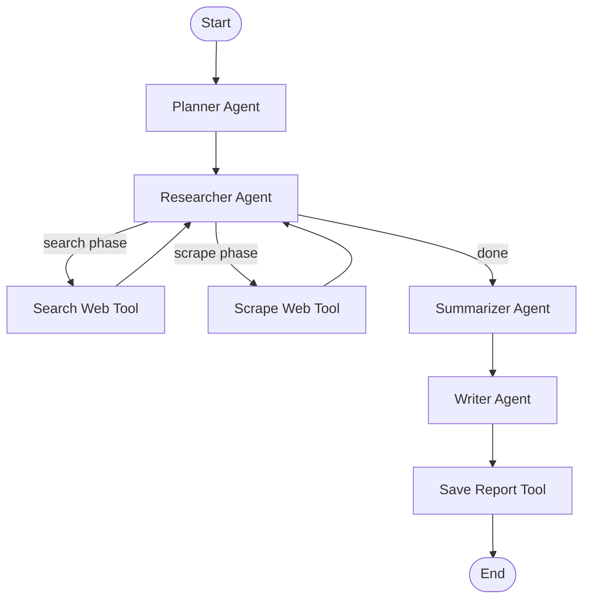

# System Design Document  
## Autonomous Research Assistant — Agentic AI System for Multi-Step Tasks

---

## 1. Overview

This system is a distributed, agent-based platform designed to execute complex, multi-step research tasks. Instead of using a single monolithic pipeline, the system decomposes work into specialized agents that communicate through an asynchronous execution graph and a message queue.

The primary goals of the design are:
- Clear separation of responsibilities between agents
- Fault isolation through decoupled execution
- Horizontal scalability using worker processes
- Real-time visibility into system progress through streaming

---

## 2. High-Level Architecture

The system is composed of three primary layers:

### Orchestration Layer
Controls the flow of execution between agents using a conditional state graph. This layer is responsible for determining when to invoke tools, when to advance to the next stage, and when to terminate the workflow.

### Execution Layer
Runs distributed worker processes that perform I/O-heavy tasks such as web search and content extraction. These workers operate independently of the orchestration process.

### Interface Layer
Provides a frontend that accepts user input and displays streamed progress updates and final output.

---

## 3. Core Components

| Component | Responsibility |
|----------|----------------|
| Orchestrator | Maintains system state and controls agent execution flow |
| Planner Agent | Converts user input into executable steps and search queries |
| Research Agent | Dispatches research tasks to the message queue |
| Worker Processes | Perform search and scraping tasks |
| Summarizer Agent | Extracts factual, structured findings |
| Writer Agent | Produces the final formatted report |
| Message Queue | Routes tasks and results between agents and workers |

---

## 4. Agent Boundaries

Each agent is designed with a single, well-defined responsibility:

### Planner Agent
- Input: User query
- Output: List of research steps and optimized search queries
- Responsibility: Task decomposition and discovery planning

### Research Agent
- Input: Search queries
- Output: Task identifiers for distributed execution
- Responsibility: Dispatching work to the queue

### Worker Processes
- Input: Tasks from the queue
- Output: Raw extracted content
- Responsibility: Performing external data collection

### Summarizer Agent
- Input: Raw content
- Output: Structured, verifiable findings and source references
- Responsibility: Information validation and consolidation

### Writer Agent
- Input: Findings and sources
- Output: Final structured report
- Responsibility: Presentation and formatting

This separation allows each agent to be scaled, tested, and modified independently.

---

## 5. Execution Flow

The system follows a staged, asynchronous pipeline:

